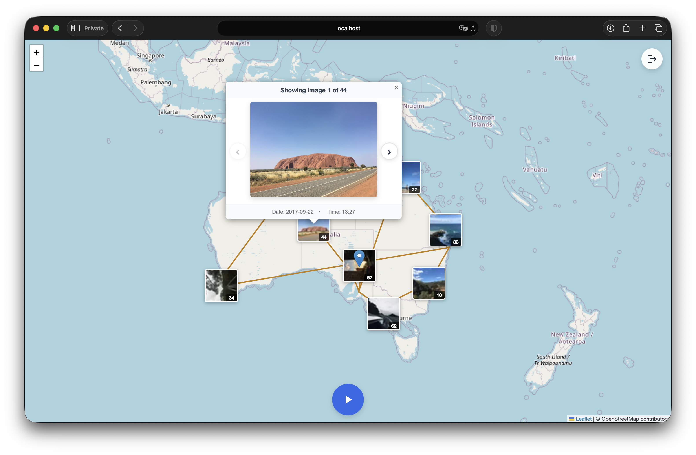
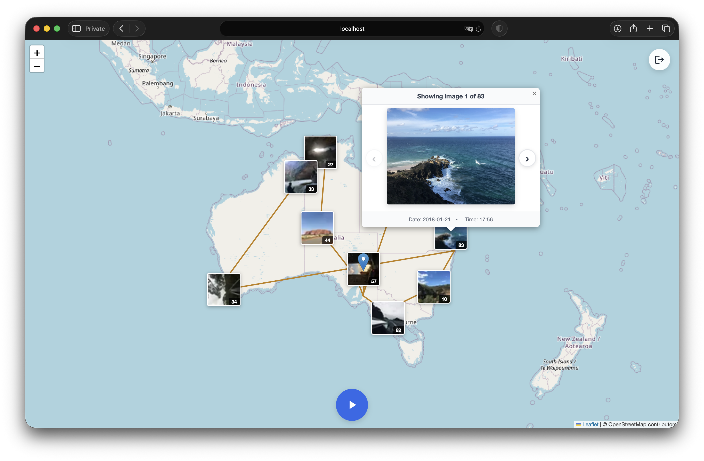

# Straya Mapp

An interactive travel photo map with an automated preprocessing pipeline to curate, score, and display your images.

<div align="center">



<div align="left">


This project consists of two main components:
1.  A **Preprocessing Pipeline** built with Python to process a large collection of photos, from exporting them out of a library to cleaning, scoring, and preparing them for the web.
2.  A **Static Frontend** built with vanilla JavaScript, HTML, and CSS that displays the processed photos on an interactive map, complete with features like photo clustering and an animated tour.

## Key Features

*   **Interactive Map**: Displays photo locations on an OpenStreetMap layer using Leaflet.js.
*   **Automated Preprocessing**: A series of scripts to handle exporting, cleaning, scoring, and optimizing images.
*   **Aesthetic Scoring**: Uses a machine learning model to automatically score images, helping to curate the best shots.
*   **Photo Clustering**: Groups nearby photos into clusters for better visibility on the map.
*   **Animated Tour**: A "play" feature that animates a route between photos in chronological order.
*   **Dual-Mode**:
    *   **Offline Mode**: Bypasses authentication and loads all assets from a local directory, suitable for simple static hosting.
    *   **Online Mode**: Authenticates users via Supabase and loads assets from Supabase Storage.


## Showcase

<div align="center">


 
<div align="left">

## Screenshots

<div align="center">




<div align="left">


## Project Layout

```
.
├── frontend/         # Contains the static web application
│   ├── web_export/   # Processed images and data for the frontend
│   ├── js/
│   └── css/
├── preprocessing/    # Python scripts for the data pipeline
├── supabase/         # Scripts for interacting with Supabase
├── images/           # Screenshots and demo videos 
└── config.json       # Configuration for the project
```

---

## Getting Started

Follow these steps to set up and run the project for local development (offline mode).

### Prerequisites

*   Python 3.8+
*   `uv` (for Python dependency management): `pip install uv`

### Setup

1.  **Clone the Repository**
    ```bash
    git clone <repository-url>
    cd straya-mapp
    ```

2.  **Install Python Dependencies**
    Use `uv` to sync with the dependencies specified in `pyproject.toml`.
    ```bash
    uv sync
    ```

3.  **Configure the Project**
    Copy the example configuration file and fill it out with your specific paths and settings:
    
    ```bash
    cp config.example.json config.json
    ```
    
    Then edit `config.json` with your actual paths and preferences:
    
    ```json
    {
        "library_path": "/path/to/your/Photos.photoslibrary",
        "start_date": "2016-10-01",
        "end_date": "2018-02-01",
        "export_path": "frontend/web_export",
        "model_batch_size": 8,
        "only_use_webp": true,
        "deduplication_threshold": 8,
        "deduplication_hash_size": 8,
        "deduplication_delete": true
    }
    ```

---

## End-to-End Workflow (Offline Mode)

This workflow will guide you through preparing your photos and viewing them locally without needing a cloud backend.

### 1. Run the Preprocessing Pipeline

Execute the scripts in the `preprocessing/` directory in order. These scripts use the settings from your `config.json`.

*   **Step 1: Export and Deduplicate**
    ```bash
    python3 preprocessing/1_export_and_remove_duplicates.py
    ```

*   **Step 2: Score and Add Metadata**
    ```bash
    python3 preprocessing/2_get_model_scores.py
    ```

*   **Step 3: Analyze and Review (Optional)**
    ```bash
    python3 preprocessing/3_get_stats.py
    ```

*   **Step 4: Export for Web**
    ```bash
    python3 preprocessing/4_export_images_for_web.py --score-min 5.0
    ```

### 2. View the Frontend

Once preprocessing is complete, serve the `frontend` directory using Python's built-in HTTP server.

```bash
cd frontend
python3 -m http.server 8000
```

Open `http://localhost:8000` in your browser to see the application.

---

## Optional: Online Mode with Supabase

For a cloud-based setup with authentication, you can configure the project to use Supabase.

### Step 1: Set up Supabase Project

1.  In your Supabase project, go to **Storage** and create three **private** buckets: `images`, `thumbnails`, and `data`.
2.  For each bucket, configure Row Level Security (RLS) policies to allow read access for authenticated users and insert/update access for the `service_role`.

<details>
<summary><b>▶︎ Click to see SQL policies for buckets</b></summary>

**For `images` bucket:**

*   **SELECT**: `(bucket_id = 'images'::text) AND (auth.role() = 'authenticated'::text)`

*   **INSERT/UPDATE**: `(bucket_id = 'images'::text) AND (auth.role() = 'service_role'::text)`

**For `thumbnails` bucket:**

*   **SELECT**: `(bucket_id = 'thumbnails'::text) AND (auth.role() = 'authenticated'::text)`

*   **INSERT/UPDATE**: `(bucket_id = 'thumbnails'::text) AND (auth.role() = 'service_role'::text)`

**For `data` bucket:**

*   **SELECT**: `(bucket_id = 'data'::text) AND (auth.role() = 'authenticated'::text)`

*   **INSERT/UPDATE**: `(bucket_id = 'data'::text) AND (auth.role() = 'service_role'::text)`

</details>

3.  In Supabase, go to **Authentication -> Users** and create a new user with an email and password. You will use these to log in to the map.

### Step 2: Configure Frontend for Online Mode

1.  Open `frontend/js/main.js` in a text editor.
2.  Change `offlineMode` to `false`.
3.  Update the Supabase credentials with your project's URL and Anon Key (found in Settings -> API in your Supabase dashboard).

    ```javascript
    // In frontend/js/main.js
    let offlineMode = false; // Set to false for online mode

    // ...

    let SUPABASE_URL = 'https://your-project-id.supabase.co';
    let SUPABASE_ANON_KEY = 'your-public-anon-key';
    let SHARED_EMAIL = 'user@example.com'; // The email of the user you created
    ```

### Step 3: Upload Data to Supabase

Run the upload script from the project root, providing your Supabase URL and **Service Role Key** (found in Settings -> API).

```bash
python3 supabase/upload.py \
  --supabase-url YOUR_SUPABASE_URL \
  --supabase-key YOUR_SERVICE_ROLE_KEY
```

This will upload your images, thumbnails, and `image_data.json` to the appropriate buckets. If any uploads fail, a `failed_uploads.json` file will be created. You can retry these with:

```bash
python3 supabase/retry_upload.py \
  --supabase-url YOUR_SUPABASE_URL \
  --supabase-key YOUR_SERVICE_ROLE_KEY
```

### Step 4: Run the Application

With the configuration complete, you can now run the frontend as described in "View the Frontend". When you open the application, you will be prompted for the password you set for your Supabase user.

---

<details>
<summary><b>▶︎ Preprocessing Pipeline Details</b></summary>

The preprocessing directory contains a series of Python scripts to process a collection of photos, from exporting them from a library to preparing them for the web application.

*   **`1_export_and_remove_duplicates.py`**: Exports photos from macOS Photos and removes duplicates.
*   **`2_get_model_scores.py`**: Generates an "aesthetic score" and extracts EXIF metadata.
*   **`3_get_stats.py`**: Computes and displays statistics and can launch review/clustering tools.
*   **`4_export_images_for_web.py`**: Optimizes and prepares images for the web frontend.
*   **Utility Scripts**: Other scripts like `delete_helpers.py` and `review_images.py` provide support for the main pipeline.

</details>

<details>
<summary><b>▶︎ Frontend Details</b></summary>

The frontend is a single-page web application that displays a collection of photos on an interactive map.

*   `index.html`: The main HTML file for the Leaflet-based map UI.
*   `js/main.js`: Core application logic.
*   `css/styles.css`: All custom styles for the application.
*   `web_export/`: The directory containing the final, processed assets consumed by the UI in offline mode.

</details>